# Architecture

Team Expecto Patronum &middot; SIH26085 &middot; Urban Flood Nowcasting System

## Pipeline

```mermaid
flowchart LR
    A[Rainfall Nowcast\nintensity + duration] --> B[Terrain / GIS\nDEM, slope, land use]
    B --> C[Rainfall-to-Runoff\nSCS Curve Number]
    C --> D[Drainage Network Graph\nnodes, capacities]
    D --> E[Physics Baseline\nkinematic-wave routing]
    E -->|training labels| F[GNN Surrogate\n+ MC-Dropout uncertainty]
    F --> G[Water Depth & Flood Risk\nper drainage node]
    G --> H[Flooded Road Detection\nspatial join to road graph]
    H --> I[Criticality-Weighted\nEmergency Rerouting]
    I --> J[Interactive 3D Flood\n+ Route Map]
```

## Stage-by-stage

**Rainfall Nowcast (input).** The prototype takes rainfall intensity (mm/hr) and
storm duration (min) as direct input -- either a pre-cached demo scenario or a
live slider value. A real deployment would feed this from IMD/NCMRWF's
short-range nowcast products; that integration is out of scope for the
prototype (see `docs/DATA_SOURCES.md`).

**Terrain / GIS (`app/gis/`).** `WardDataProvider` is the abstract seam between
data sourcing and everything downstream. `SyntheticWardProvider` generates a
deterministic 2km x 2km reference ward (elevation, land use, road network,
drainage tags, critical infrastructure) from a fixed seed, guaranteeing the
demo always runs offline. `RealWardProvider` implements the same interface
over OpenStreetMap + a downloaded SRTM tile. `dem.py` derives slope, D8 flow
direction, and flow accumulation from the elevation grid.

**Rainfall-to-Runoff (`app/hydrology/scs_cn.py`).** Standard SCS/NRCS Curve
Number method converts rainfall depth to runoff depth per grid cell, using
each cell's land-use-derived curve number.

**Drainage Network Graph (`app/gis/drainage_graph.py`).** A directed graph
over drain-tagged road-network nodes, with each edge's hydraulic capacity
estimated via Manning's equation for an assumed pipe diameter (residential vs.
arterial). This is the graph the GNN operates over.

**Physics Baseline (`app/ml/physics_baseline.py`).** A simplified
kinematic-wave / Muskingum-style routing engine: local catchment runoff is
injected at each node every timestep, water is pushed downstream capped by
edge capacity, and anything that can't be routed accumulates as ponded depth.
This is the ONLY "ground truth" in the prototype -- it generates the GNN's
training labels AND is the sole validation baseline. **It is not a certified
hydraulic model.**

**GNN Surrogate (`app/ml/model.py`, `train.py`, `infer.py`).** A 3-layer GCN
learns to approximate the physics baseline's output, trained across a sweep
of rainfall intensity x duration scenarios. Monte Carlo Dropout at inference
time (20 stochastic passes) gives a mean + std uncertainty band per node --
required, never a placeholder.

**Water Depth & Flood Risk.** The GNN's mean/std predictions per drainage node
ARE the flood risk surface, surfaced with their uncertainty band on the map
and in the UncertaintyPanel.

**Flooded Road Detection (`app/routing/road_graph.py`).** Each road edge is
spatially joined to its nearest drainage node; the node's predicted depth
against fixed thresholds (`DEPTH_THRESHOLD_AT_RISK_M`,
`DEPTH_THRESHOLD_FLOODED_M`) sets the edge's `clear` / `at_risk` / `flooded`
state.

**Criticality-Weighted Emergency Rerouting (`app/routing/router.py`,
`criticality.py`).** Dijkstra/A* route with flood-state-dependent edge
penalties (flooded = infinite cost). Separately, `criticality.py` computes an
access-redundancy score (edge-disjoint paths to the nearest arterial) for
every critical-infrastructure node, raising a distinct `CriticalAccessRisk`
when that redundancy hits zero -- the differentiator feature.

**Interactive Map (`frontend/`).** MapLibre GL JS base map with Deck.gl
overlays: road state, a flood-depth heatmap, a translucent uncertainty
overlay, critical-infrastructure markers, and animated route paths
(baseline vs. flood-aware, side by side).

## Synthetic vs. real data boundary

Everything from the `WardDataProvider` interface downward is identical
regardless of data source. The boundary is entirely inside `app/gis/`:
`SyntheticWardProvider` (deterministic, seed=42, always available) vs.
`RealWardProvider` (OSM + SRTM, requires `REAL_WARD_BBOX` and a downloaded DEM
tile). `is_synthetic` propagates all the way to the API response
(`is_synthetic_ward`) and the UI badge -- the product never implies real-world
data when it isn't.
